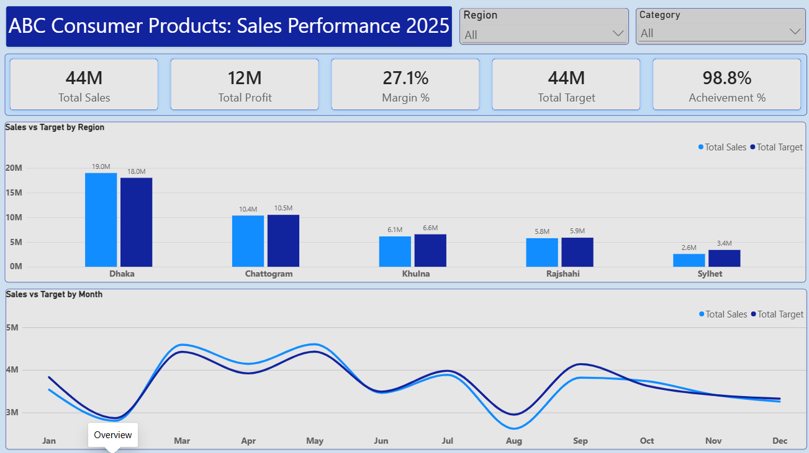

# FMCG Sales Performance Analysis

An end-to-end business case study using **Excel (Power Query, Pivot Tables)** and **Power BI (DAX, dashboard)**.

## Business problem
ABC Consumer Products Ltd. (a fictional FMCG company) is growing, but not every territory and product performs the same way.
Management wants to know: **where are we performing well, where are we underperforming, and what actions could improve sales and profitability?**

## Questions answered
1. How is overall sales performance?
2. Which regions and territories are doing well or badly?
3. Which products and categories bring the most revenue and profit?
4. How do actual sales compare with target?
5. What should management do?

## Dataset
- Simulated data: 1,000 sales transactions, January to December 2025, in BDT.
- 5 regions, 18 territories, 13 salespeople, 8 distributors, 18 products, 4 categories.
- Columns: Date, Region, Territory, Salesperson, Distributor, Product, Category, Units_Sold, Sales, Cost, Target.
- The raw file was deliberately messy (see the data cleaning section).

## Tools
| Tool | Used for |
|---|---|
| Excel Power Query | Data cleaning |
| Excel Pivot Tables | Exploration and cross-checking totals |
| Power BI Desktop | Data model, DAX measures, dashboard |

## Data cleaning
1,003 rows in the raw file became **881 clean rows**. Full details are in `Issue_Log` worksheet.

| Stage | Rows |
|---|---|
| Raw file (includes 3 blank rows) | 1,003 |
| After removing blank rows | 1,000 |
| After removing blank or impossible dates | 990 |
| After removing zero, blank and negative Sales, Cost, Target | 914 |
| After removing extremely high Sales | 910 |
| After removing duplicates | **881** |

Main fixes:
- Standardized spelling, case and spaces in Region, Territory, Salesperson, Distributor, Product and Category.
- Took Region from the master Territory list, and Product and Category from the master Product list.
- Converted text dates and text numbers (for example `Tk 62,555`) to real dates and numbers.
- Detected extreme values by comparing each row's price per unit with the product's typical price.
- Left blank Units_Sold empty instead of estimating it.

## DAX measures
```
Total Sales   = SUM(FactSales[Sales])
Total Cost    = SUM(FactSales[Cost])
Total Target  = SUM(FactSales[Target])
Total Profit  = [Total Sales] - [Total Cost]
Margin %      = DIVIDE([Total Profit], [Total Sales])
Achievement % = DIVIDE([Total Sales], [Total Target])
Sales vs Target = [Total Sales] - [Total Target]
Units Sold    = SUM(FactSales[Units_Sold])
```

## Key findings
1. Sales are 43.9M against a 44.4M target (98.8%). Profit margin is 27.1%.
2. Dhaka is 43% of sales and the only region above target. Sylhet reaches just 76%.
3. Five territories are far behind: Moulvibazar, Kushtia, Sylhet Sadar, Halishahar and Pahartali (66% to 82% of target).
4. Energy Drink A sells well (122% of target) but earns only a 4.4% margin.
5. Floor Cleaner A (57%) and Juice B (75%) are far below target.
6. Sales peak from March to May and fall in August.

## Recommendations
1. Make a recovery plan for the five weak territories.
2. Review Energy Drink A pricing and discounts to improve its margin.
3. Check why Floor Cleaner A and Juice B are behind, and act or review the range.
4. Copy what works in Gulshan and Uttara in the weaker territories.
5. Plan stock and promotions for March to May, and for the August dip.

## Dashboard



## Limitations
- The data is simulated.
- 119 of 1,000 records were removed during cleaning.
- Causes are not proven. The recommendations are next steps to investigate.

## Repository contents
```
FMCG_Sales_Project.xlsx    Raw data, mapping tables, clean data and pivots
FMCG_Sales_Dashboard.pbix  Power BI dashboard
images/                    Dashboard screenshots
README.md
```

## How to open
Open the `.pbix` file in Power BI Desktop. If Power BI cannot find the Excel file, go to Transform data → Data source settings and point it to `FMCG_Sales_Project.xlsx` in the same folder.
